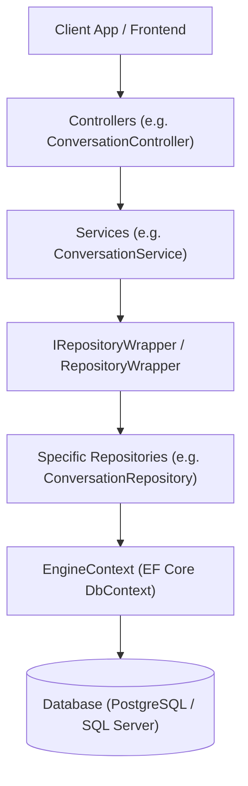
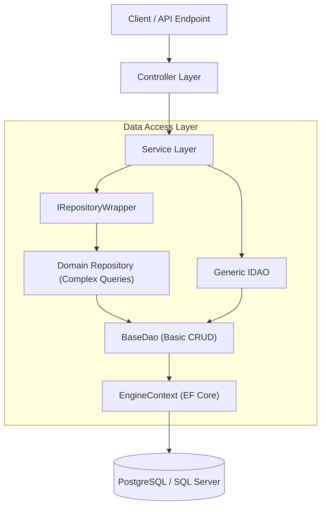

# AI Engine Data Access Object (DAO) Architecture Plan

This document provides a deep architectural analysis of the current data access layers in **AI Engine** and outlines the design and step-by-step placement strategy for introducing a generic **Data Access Object (DAO)** mechanism for basic CRUD operations.

---

## 1. Existing System Architecture Analysis

The `ai-engine` solution follows a clean separation of concerns split across distinct project layers:

```
w:\Ai-workspace\ai-engine\
├── AIEngineConnectivity/              <-- Contracts, Entities, DTOs & Interfaces
├── AIEngineGateway/                   <-- Web API Gateway, EF Core DbContext, Repositories, Services
├── AIEngineCore/                      <-- Core Engine AI Logic & Orchestration
└── AIEngineSpeechRecognition/         <-- Speech Recognition Services
```

### Current Data Access Flow

Currently, incoming HTTP requests flow through the system as follows:



### Existing Key Components

| Component | File Path | Description |
| :--- | :--- | :--- |
| **DbContext** | [EngineContext.cs](file:///w:/Ai-workspace/ai-engine/AIEngineGateway/EngineInfrastructure/EngineContext.cs) | Abstract EF Core DbContext defining `DbSet<User>`, `DbSet<Conversation>`, `DbSet<Message>`, etc. |
| **Providers** | [SqlServerEngineContext.cs](file:///w:/Ai-workspace/ai-engine/AIEngineGateway/EngineInfrastructure/SqlServerEngineContext.cs)<br/>[PostgreSqlEngineContext.cs](file:///w:/Ai-workspace/ai-engine/AIEngineGateway/EngineInfrastructure/PostgreSqlEngineContext.cs) | Concrete DbContext implementations for database multi-provider support. |
| **Contracts** | [IRepositoryWrapper.cs](file:///w:/Ai-workspace/ai-engine/AIEngineConnectivity/Repositories/IRepositoryWrapper.cs)<br/>[IConversationRepository.cs](file:///w:/Ai-workspace/ai-engine/AIEngineConnectivity/Repositories/IConversationRepository.cs) | Interfaces in `AIEngineConnectivity` defining repository operations. |
| **Repositories** | [RepositoryWrapper.cs](file:///w:/Ai-workspace/ai-engine/AIEngineGateway/Repositories/RepositoryWrapper.cs)<br/>[ConversationRepository.cs](file:///w:/Ai-workspace/ai-engine/AIEngineGateway/Repositories/ConversationRepository.cs) | Implementations in `AIEngineGateway` performing EF Core queries. |
| **DI Setup** | [ServiceExtentions.cs](file:///w:/Ai-workspace/ai-engine/AIEngineGateway/Extensions/ServiceExtentions.cs) | Extension methods registering DbContexts, Repositories, and Services into ASP.NET Core DI. |

### Current Limitations & Need for DAO

1. **Repetitive Basic CRUD**: Simple CRUD operations (`AddAsync`, `GetByIdAsync`, `Update`, `Delete`) are manually written inside each domain-specific repository class.
2. **Entity Overhead**: Entities without custom repository logic still require writing custom interfaces and repository classes just to perform simple queries.
3. **Lack of Standardization**: Basic persistence logic (such as soft deletes, pagination, existence checks) is scattered rather than unified in a reusable base component.

---

## 2. Proposed DAO Architecture Design

The **DAO (Data Access Object) Pattern** will sit directly between Entity Framework Core (`EngineContext`) and your Domain Repositories / Services.

### Integrated Architecture Flow



---

## 3. Directory & File Placement Strategy

Here is the exact plan for where new DAO files will be placed and which existing files will be updated:

```
w:\Ai-workspace\ai-engine\
│
├── AIEngineConnectivity/                      <-- Interface Layer
│   └── DAO/                                   <-- [NEW DIRECTORY]
│       ├── IDAO.cs                            <-- [NEW FILE] Generic CRUD interface
│       └── IPaginatedList.cs                  <-- [NEW FILE] Pagination helper contract (optional)
│   └── Repositories/
│       └── IRepositoryWrapper.cs              <-- [MODIFY] Add generic DAO accessor
│
└── AIEngineGateway/                           <-- Implementation Layer
    ├── DAO/                                   <-- [NEW DIRECTORY]
    │   └── BaseDao.cs                         <-- [NEW FILE] EF Core generic DAO implementation
    ├── Repositories/
    │   └── RepositoryWrapper.cs               <-- [MODIFY] Inject and provide generic DAO instances
    └── Extensions/
        └── ServiceExtentions.cs               <-- [MODIFY] Register open generic IDAO in DI container
```

---

## 4. Detailed Implementation Blueprints

### 4.1 Interface Definition: `IDAO<TEntity, TKey>`
**Location**: `w:\Ai-workspace\ai-engine\AIEngineConnectivity\DAO\IDAO.cs`

```csharp
namespace AIEngineConnectivity.DAO
{
    using System;
    using System.Collections.Generic;
    using System.Linq;
    using System.Linq.Expressions;
    using System.Threading;
    using System.Threading.Tasks;

    /// <summary>
    /// Generic Data Access Object (DAO) interface for standard CRUD and query operations.
    /// </summary>
    /// <typeparam name="TEntity">The entity type.</typeparam>
    /// <typeparam name="TKey">The primary key type of the entity.</typeparam>
    public interface IDAO<TEntity, TKey> where TEntity : class
    {
        // --- CREATE ---
        Task<TEntity> AddAsync(TEntity entity, CancellationToken cancellationToken = default);
        Task AddRangeAsync(IEnumerable<TEntity> entities, CancellationToken cancellationToken = default);

        // --- READ ---
        Task<TEntity?> GetByIdAsync(TKey id, CancellationToken cancellationToken = default);
        Task<IEnumerable<TEntity>> GetAllAsync(CancellationToken cancellationToken = default);
        Task<IEnumerable<TEntity>> FindAsync(Expression<Func<TEntity, bool>> predicate, CancellationToken cancellationToken = default);
        Task<TEntity?> FirstOrDefaultAsync(Expression<Func<TEntity, bool>> predicate, CancellationToken cancellationToken = default);
        IQueryable<TEntity> Query(Expression<Func<TEntity, bool>>? predicate = null);
        Task<bool> ExistsAsync(Expression<Func<TEntity, bool>> predicate, CancellationToken cancellationToken = default);
        Task<int> CountAsync(Expression<Func<TEntity, bool>>? predicate = null, CancellationToken cancellationToken = default);

        // --- UPDATE ---
        void Update(TEntity entity);
        void UpdateRange(IEnumerable<TEntity> entities);

        // --- DELETE ---
        void Delete(TEntity entity);
        void DeleteRange(IEnumerable<TEntity> entities);
    }
}
```

---

### 4.2 Implementation: `BaseDao<TEntity, TKey>`
**Location**: `w:\Ai-workspace\ai-engine\AIEngineGateway\DAO\BaseDao.cs`

```csharp
namespace AIEngineGateway.DAO
{
    using AIEngineConnectivity.DAO;
    using AIEngineGateway.EngineInfrastructure;
    using Microsoft.EntityFrameworkCore;
    using System;
    using System.Collections.Generic;
    using System.Linq;
    using System.Linq.Expressions;
    using System.Threading;
    using System.Threading.Tasks;

    /// <summary>
    /// Base implementation of the Generic Data Access Object using Entity Framework Core.
    /// </summary>
    public class BaseDao<TEntity, TKey> : IDAO<TEntity, TKey> where TEntity : class
    {
        protected readonly EngineContext _context;
        protected readonly DbSet<TEntity> _dbSet;

        public BaseDao(EngineContext context)
        {
            _context = context ?? throw new ArgumentNullException(nameof(context));
            _dbSet = _context.Set<TEntity>();
        }

        public async Task<TEntity> AddAsync(TEntity entity, CancellationToken cancellationToken = default)
        {
            var entry = await _dbSet.AddAsync(entity, cancellationToken);
            return entry.Entity;
        }

        public async Task AddRangeAsync(IEnumerable<TEntity> entities, CancellationToken cancellationToken = default)
        {
            await _dbSet.AddRangeAsync(entities, cancellationToken);
        }

        public async Task<TEntity?> GetByIdAsync(TKey id, CancellationToken cancellationToken = default)
        {
            return await _dbSet.FindAsync(new object[] { id! }, cancellationToken);
        }

        public async Task<IEnumerable<TEntity>> GetAllAsync(CancellationToken cancellationToken = default)
        {
            return await _dbSet.ToListAsync(cancellationToken);
        }

        public async Task<IEnumerable<TEntity>> FindAsync(Expression<Func<TEntity, bool>> predicate, CancellationToken cancellationToken = default)
        {
            return await _dbSet.Where(predicate).ToListAsync(cancellationToken);
        }

        public async Task<TEntity?> FirstOrDefaultAsync(Expression<Func<TEntity, bool>> predicate, CancellationToken cancellationToken = default)
        {
            return await _dbSet.FirstOrDefaultAsync(predicate, cancellationToken);
        }

        public IQueryable<TEntity> Query(Expression<Func<TEntity, bool>>? predicate = null)
        {
            return predicate == null ? _dbSet.AsNoTracking() : _dbSet.Where(predicate).AsNoTracking();
        }

        public async Task<bool> ExistsAsync(Expression<Func<TEntity, bool>> predicate, CancellationToken cancellationToken = default)
        {
            return await _dbSet.AnyAsync(predicate, cancellationToken);
        }

        public async Task<int> CountAsync(Expression<Func<TEntity, bool>>? predicate = null, CancellationToken cancellationToken = default)
        {
            return predicate == null 
                ? await _dbSet.CountAsync(cancellationToken) 
                : await _dbSet.CountAsync(predicate, cancellationToken);
        }

        public void Update(TEntity entity)
        {
            _dbSet.Update(entity);
        }

        public void UpdateRange(IEnumerable<TEntity> entities)
        {
            _dbSet.UpdateRange(entities);
        }

        public void Delete(TEntity entity)
        {
            _dbSet.Remove(entity);
        }

        public void DeleteRange(IEnumerable<TEntity> entities)
        {
            _dbSet.RemoveRange(entities);
        }
    }
}
```

---

### 4.3 Updating `IRepositoryWrapper` and `RepositoryWrapper`

#### Modify `IRepositoryWrapper.cs`
**File**: [IRepositoryWrapper.cs](file:///w:/Ai-workspace/ai-engine/AIEngineConnectivity/Repositories/IRepositoryWrapper.cs)

```csharp
namespace AIEngineConnectivity.Repositories
{
    using AIEngineConnectivity.DAO;
    using System.Threading;
    using System.Threading.Tasks;

    public interface IRepositoryWrapper
    {
        IIdentityRepository IdentityRepository { get; }
        IConversationRepository ConversationRepository { get; }
        IConnectionRepository ConnectionRepository { get; }
        IDataProtectionKeyRepository DataProtectionKeyRepository { get; }

        // --- NEW: Generic DAO Accessor for any entity ---
        IDAO<TEntity, TKey> GetDao<TEntity, TKey>() where TEntity : class;

        Task<int> SaveChangesAsync(CancellationToken cancellationToken = default);
    }
}
```

#### Modify `RepositoryWrapper.cs`
**File**: [RepositoryWrapper.cs](file:///w:/Ai-workspace/ai-engine/AIEngineGateway/Repositories/RepositoryWrapper.cs)

```csharp
namespace AIEngineGateway.Repositories
{
    using AIEngineConnectivity.DAO;
    using AIEngineConnectivity.Repositories;
    using AIEngineGateway.DAO;
    using AIEngineGateway.EngineInfrastructure;
    using Microsoft.Extensions.DependencyInjection;
    using System;

    public class RepositoryWrapper : IRepositoryWrapper
    {
        private readonly EngineContext _engineContext;
        private readonly IServiceProvider _serviceProvider;

        public IIdentityRepository IdentityRepository { get; }
        public IConversationRepository ConversationRepository { get; }
        public IConnectionRepository ConnectionRepository { get; }
        public IDataProtectionKeyRepository DataProtectionKeyRepository { get; }

        public RepositoryWrapper(
            IIdentityRepository identityRepository,
            IConversationRepository conversationRepository,
            IConnectionRepository connectionRepository,
            IDataProtectionKeyRepository dataProtectionKeyRepository,
            EngineContext engineContext,
            IServiceProvider serviceProvider)
        {
            IdentityRepository = identityRepository;
            ConversationRepository = conversationRepository;
            ConnectionRepository = connectionRepository;
            DataProtectionKeyRepository = dataProtectionKeyRepository;
            _engineContext = engineContext;
            _serviceProvider = serviceProvider;
        }

        public IDAO<TEntity, TKey> GetDao<TEntity, TKey>() where TEntity : class
        {
            return _serviceProvider.GetRequiredService<IDAO<TEntity, TKey>>();
        }

        public async Task<int> SaveChangesAsync(CancellationToken cancellationToken = default)
        {
            return await _engineContext.SaveChangesAsync(cancellationToken);
        }
    }
}
```

---

### 4.4 Dependency Injection Registration
**File**: [ServiceExtentions.cs](file:///w:/Ai-workspace/ai-engine/AIEngineGateway/Extensions/ServiceExtentions.cs)

In `EngineRepositories` method, add the open generic registration:

```csharp
public static void EngineRepositories(IServiceCollection services)
{
    // Register Generic DAO for open generic resolution
    services.AddScoped(typeof(IDAO<,>), typeof(BaseDao<,>));

    services.AddScoped<IRepositoryWrapper, RepositoryWrapper>();
    services.AddScoped<IIdentityRepository, IdentityRepository>();
    services.AddScoped<IConversationRepository, ConversationRepository>();
    services.AddScoped<IConnectionRepository, ConnectionRepository>();
    services.AddScoped<IDataProtectionKeyRepository, DataProtectionKeyRepository>();
}
```

---

## 5. Usage Example: How to Use DAO for Basic CRUD

Once implemented, basic CRUD operations for any entity (e.g., `Project`, `User`, `Conversation`) can be executed effortlessly without writing custom SQL or repetitive EF queries:

### Example: CRUD inside a Service Layer

```csharp
public class ProjectService
{
    private readonly IDAO<Project, int> _projectDao;
    private readonly IRepositoryWrapper _repositoryWrapper;

    public ProjectService(IDAO<Project, int> projectDao, IRepositoryWrapper repositoryWrapper)
    {
        _projectDao = projectDao;
        _repositoryWrapper = repositoryWrapper;
    }

    // 1. CREATE
    public async Task<Project> CreateProjectAsync(Project newProject, CancellationToken cancellationToken)
    {
        var created = await _projectDao.AddAsync(newProject, cancellationToken);
        await _repositoryWrapper.SaveChangesAsync(cancellationToken);
        return created;
    }

    // 2. READ (GET BY ID)
    public async Task<Project?> GetProjectByIdAsync(int id, CancellationToken cancellationToken)
    {
        return await _projectDao.GetByIdAsync(id, cancellationToken);
    }

    // 3. READ (FIND BY CONDITION)
    public async Task<IEnumerable<Project>> GetActiveProjectsAsync(Guid ownerId, CancellationToken cancellationToken)
    {
        return await _projectDao.FindAsync(p => p.UserId == ownerId && !p.IsDeleted, cancellationToken);
    }

    // 4. UPDATE
    public async Task UpdateProjectNameAsync(int id, string newName, CancellationToken cancellationToken)
    {
        var project = await _projectDao.GetByIdAsync(id, cancellationToken);
        if (project != null)
        {
            project.Name = newName;
            _projectDao.Update(project);
            await _repositoryWrapper.SaveChangesAsync(cancellationToken);
        }
    }

    // 5. DELETE
    public async Task DeleteProjectAsync(int id, CancellationToken cancellationToken)
    {
        var project = await _projectDao.GetByIdAsync(id, cancellationToken);
        if (project != null)
        {
            _projectDao.Delete(project);
            await _repositoryWrapper.SaveChangesAsync(cancellationToken);
        }
    }
}
```

---

## 6. Implementation Checklist & Migration Roadmap

1. [ ] **Create Interface**: Add `IDAO<TEntity, TKey>` in `AIEngineConnectivity/DAO/IDAO.cs`.
2. [ ] **Create Implementation**: Add `BaseDao<TEntity, TKey>` in `AIEngineGateway/DAO/BaseDao.cs`.
3. [ ] **Register in DI**: Update `ServiceExtentions.cs` with `services.AddScoped(typeof(IDAO<,>), typeof(BaseDao<,>));`.
4. [ ] **Update Repository Wrapper**: Update `IRepositoryWrapper` and `RepositoryWrapper` to expose `GetDao<TEntity, TKey>()`.
5. [ ] **Refactor Existing Repositories**: Inherit `BaseDao<TEntity, TKey>` inside existing repositories (e.g. `ConversationRepository`) to inherit basic CRUD methods automatically.
